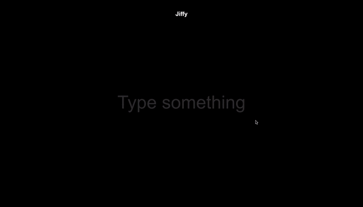

# Jiffy

[alena-alyona-jiffy.netlify.app](https://alena-alyona-jiffy.netlify.app/) 

<strong>desktop, no throttling</strong> 
 

<strong>desktop, throttling</strong> 
 

<strong>mobile</strong> 
 

This project was made as a part of SuperHi Course <em>Advanced CSS + Javascript</em>

SuperHi has its own editor and publishes your project for you, which is nice indeed but I don't really need it, so
:white_check_mark: I made this site using React, deployed to Netlify

Initially this project was made by using pure JS, CSS and DOM manipulation. You can check it out in [<em>course_solution</em> folder](https://github.com/AlenaAlyona/jiffy/tree/development/src/course_solution)

It was interesting to learn how can you achieve such result without using any frameworks, but I had another goal:

It was quite some time ago when I last worked with React, so I decided to dust off my knowledge. Plus it was interesting to make this project includes not only content rendering, but also data fetching.

following improvements have been made:

:tiger: <strong>loading states for fetching and rendering gifs</strong>  
initially spinner was shown only for fetching gifs.
If the user's connection is good, then they might barely notice it, but in case of poor connection the user saw the following: 1) fetching started => spinner is shown 2) fetching is done => spinner is hidden, hint is shown: "hit to see more..." although gif src is still loading and hasn't been rendered
Such a situation might flood the API with GET requests and then all of a sudden render everything at once (since we show gifs on top of each other, there's no use in fetching them all at once if the user can't see them in the end. They see only the last fetched)

:rabbit: <strong>clear search conditionally</strong>  
initially the user could clear the search at any moment, no matter what loading state was.
Let's imagine a situation: the user starts looking for a gif, but loading is taking a while, then they hit <em>clear search button</em>. Even though visually it seems like search is cleared, fetching is still going and it will render that last gif when it's done loading.
To avoid such situations, I added conditional where we check loading states and length of fetched gifs. Also I wrapped the image inside the button tag, since it's easier to disable the button and add different cursor styles (pointer and not-allowed).

:pig: <strong>trigger fetching by clicking on a loaded gif</strong>  
before fetching was triggered only by hitting enter. If the user accesses the app on their mobile, they can download only one gif (since gifs stack on top of input). To make this app mobile friendlier I've added a trigger on click. This solution also required a small change in displaying hint text.

:monkey_face: <strong>playing a gif</strong>  
if the user accesses the app on the desktop, there's zero problems with playing the gifs. But on the mobile gifs were popping up with video controls and acting as a regular video (in fact they are videos with mp4 format). So I added `playsinline` and `muted` attributes, so they have the same behaviour on mobile as on desktop.

:flamingo: <strong>app height</strong>  
initially 100vh was used on an outer container which worked perfectly on desktop, but was causing problems on a mobile. The only working solution I found: remove `height` from body tag, add `height: 100%, position: fixed` to the outer container. Since this is a one page app, this solution worked like a charm.

:unicorn: <strong>conclusion</strong>  
I learnt a lot about DOM manipulation and discovered for myself a grid layout. I don't regret my decision to make this app using React as it gave me an opportunity to recall how to work with this library and tackle a few interesting cases.

# Getting Started with Create React App

This project was bootstrapped with [Create React App](https://github.com/facebook/create-react-app).

## Available Scripts

In the project directory, you can run:

### `npm start`

Runs the app in the development mode.\
Open [http://localhost:3000](http://localhost:3000) to view it in the browser.

The page will reload if you make edits.\
You will also see any lint errors in the console.

### `npm test`

Launches the test runner in the interactive watch mode.\
See the section about [running tests](https://facebook.github.io/create-react-app/docs/running-tests) for more information.

### `npm run build`

Builds the app for production to the `build` folder.\
It correctly bundles React in production mode and optimizes the build for the best performance.

The build is minified and the filenames include the hashes.\
Your app is ready to be deployed!

See the section about [deployment](https://facebook.github.io/create-react-app/docs/deployment) for more information.

### `npm run eject`

**Note: this is a one-way operation. Once you `eject`, you can’t go back!**

If you aren’t satisfied with the build tool and configuration choices, you can `eject` at any time. This command will remove the single build dependency from your project.

Instead, it will copy all the configuration files and the transitive dependencies (webpack, Babel, ESLint, etc) right into your project so you have full control over them. All of the commands except `eject` will still work, but they will point to the copied scripts so you can tweak them. At this point you’re on your own.

You don’t have to ever use `eject`. The curated feature set is suitable for small and middle deployments, and you shouldn’t feel obligated to use this feature. However we understand that this tool wouldn’t be useful if you couldn’t customize it when you are ready for it.

## Learn More

You can learn more in the [Create React App documentation](https://facebook.github.io/create-react-app/docs/getting-started).

To learn React, check out the [React documentation](https://reactjs.org/).

### Code Splitting

This section has moved here: [https://facebook.github.io/create-react-app/docs/code-splitting](https://facebook.github.io/create-react-app/docs/code-splitting)

### Analyzing the Bundle Size

This section has moved here: [https://facebook.github.io/create-react-app/docs/analyzing-the-bundle-size](https://facebook.github.io/create-react-app/docs/analyzing-the-bundle-size)

### Making a Progressive Web App

This section has moved here: [https://facebook.github.io/create-react-app/docs/making-a-progressive-web-app](https://facebook.github.io/create-react-app/docs/making-a-progressive-web-app)

### Advanced Configuration

This section has moved here: [https://facebook.github.io/create-react-app/docs/advanced-configuration](https://facebook.github.io/create-react-app/docs/advanced-configuration)

### Deployment

This section has moved here: [https://facebook.github.io/create-react-app/docs/deployment](https://facebook.github.io/create-react-app/docs/deployment)

### `npm run build` fails to minify

This section has moved here: [https://facebook.github.io/create-react-app/docs/troubleshooting#npm-run-build-fails-to-minify](https://facebook.github.io/create-react-app/docs/troubleshooting#npm-run-build-fails-to-minify)
